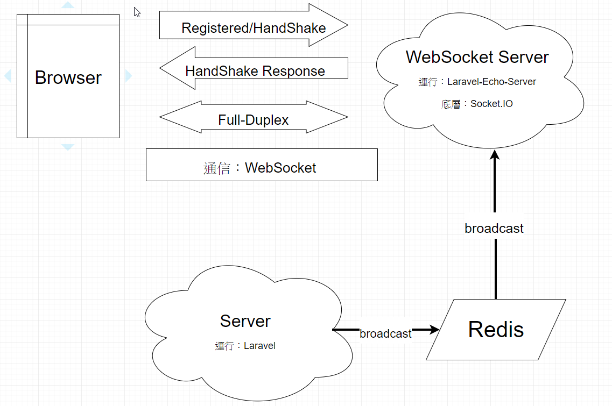
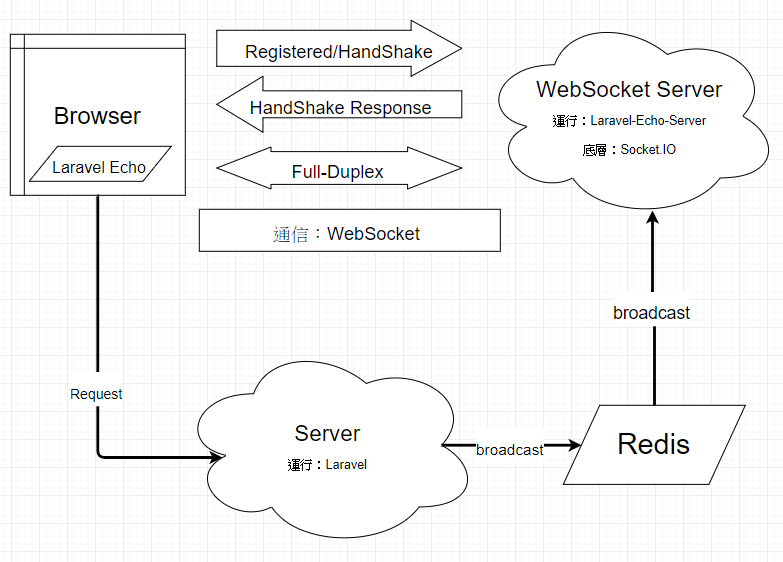

目錄

1.  聊天室的全雙工通道 - WebSocket &Socket.IO介紹

2.  LARAVEL 與 SOCKET SERVER 的驅動器 - Redis功能與介紹

3.  讓SOCKET SERVER動起來的服務器 - LARAVEL-ECHO-SERVER介紹

4.  接收來自SOCKET SERVER訊息 - LARAVEL ECHO介紹


## 聊天室的全雙工通道-WebSocket & Socket.IO介紹

1.  **WebSocket**

>   是一種HTML5之後的新通訊協定，使用TCP協定，此技術目的為解決HTTP無法達到全雙工通訊的缺點
>   <br/>
>   過去HTTP為發出一個Request給Server取回一個Response，當Clinent想隨時顯示最新的資料時，
>   必須不斷的送出Request，並檢查是否有新的Response回來，此動作會浪費大量的頻寬

>   WebSocket的作法是，由瀏覽器送出Handshake到Socket
>   Server，Server認證此瀏覽器可以連線後送回訊息，雙方及建立起一條全雙工Channel，雙方可互相傳遞訊息

2.  **Socket.IO**

>   是一個完全由 JavaScript 實現並基於
>   Node.js的即時通信、跨平臺的開源框架，它包括了用戶端的 JavaScript
>   和伺服器端的 Node.js。

>   Socket.IO 設計的目標是支援任何的主流瀏覽器(Mobile,PC)的通信，方式有下列幾種

1.  WebSocket

2.  Adobe Flash Socket

3.  AJAX long-polling

4.  AJAX multipart streaming

5.  Forever IFrame

6.  JSONP polling

>   實際上Socket.IO 幾乎都是使用 WebSocket 來傳輸，所以 Socket.IO 也可以視為一個
>   WebSocket的通信工具，除非某些瀏覽器不支援WebSocket，則會自動轉換其他方式傳輸，但API使用方式則維持不變，主要工作為控制通信的IO。

<br/>

＃透過運行Laravel-Echo-Server使伺服器變成Socket Server


# LARAVEL 與 SOCKET SERVER 的驅動器-Redis 功能與介紹

Redis是一種 儲存於記憶體內的鍵與值資料庫系統，因此常常被用在需要快取（Cache）一些資料的場合，可以減輕許多後端資料庫的壓力，在laravel可使用Redis來發送訊息給Socket
Server 

<br/>


# 讓SOCKET SERVER動起來的服務器-LARAVEL-ECHO-SERVER 介紹


Laravel-Echo-Server是使  Laravel Echo 搭配 Socket.IO 的服務器，類似於自架 pusher
server，此套件是Laravel官方推薦

<br/>


<br/>
<br/>
# 接收來自SOCKET SERVER訊息-LARAVEL ECHO 介紹

Laravel Echo是一個Javascript包，運行在Client端，透過Laravel自帶的Redis驅動，我們可以很方便地在客戶端建立Channel，總共會有三種Channel 類型


一、  Public 公開頻道

​	公開頻道是任何人都可以訂閱或監聽的頻道，預設定義的都是公開頻道。

二、 Private

​	私有頻道要求監聽前必須先授權當前認證用戶。

​	#（頻道名稱以 private- 開頭）

三、 Presence

​	既存頻道可得知用戶進入或離開頻道，裡面包含有here、joining、leaving 三種事件


JS程式結構為
```javascript
Echo.private('order.\${orderId}')

.listen(' first-channel ', (e) =\> {

console.log(e.update);

});
```

頻道的授權(routes/channels.php)


```php
Broadcast::channel('first-channel', function (\$user) {

return (int) \$user-\>id === 1;

});  
```
注意：這裡頻道名不需要加 private- 或 presence- 修飾首碼
